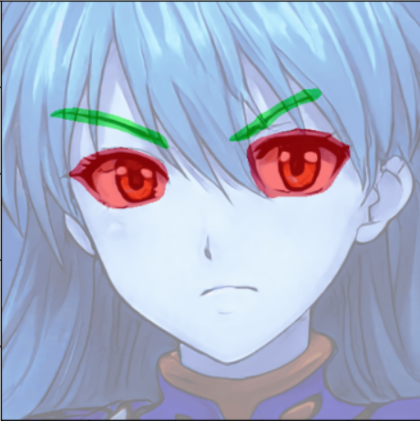

# Anime Segmentation
Segment **eyebrows, eyes** regions from anime images. 

## Installation
Install package
```bash
pip install git+https://github.com/phv2312/anime_facial_segmentation.git
```

## Usage
The model uses GPU. No support for runtime changes for now. To run inference
```python
import cv2
from mit_semseg.inference.anime_inference import AnimeInference
from mit_semseg.inference.image_utils import visualize_pred_mask, imshow

encoder_path = "<your_encoder_weight_path>"
decoder_path = "<your_decoder_weight_path>"
config_path  = "<your_config_path>"
image_path   = "<your_image_path>"

# model initialization
model = AnimeInference(encoder_path, decoder_path, config_path)

# model inference
image = cv2.imread(image_path)
results = model.process(image_path)

# visualize
visualize = visualize_pred_mask(image, results[0], threshold=0.3)
imshow(visualize)
```

## Samples


[From left to right: Test Image, Predicted Result]
